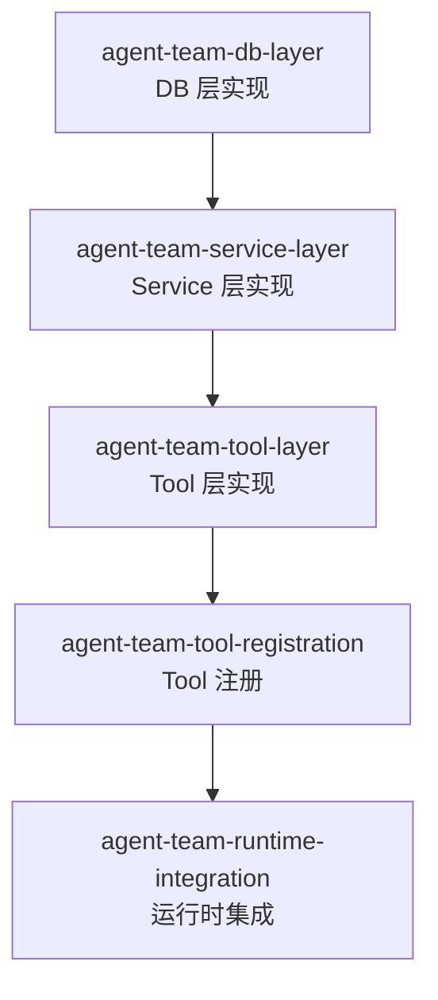

# DAG 任务图: agent-team

**日期:** 2026-06-24
**来源:** [agent-team 技术方案](./agent-team.md)

---

## 依赖图



**依赖性质：严格链式依赖，无并行批次。**

---

## 任务列表

### Batch 1（无依赖）

| Slug | 产出文件 | 预估 | 验收标准 |
|------|---------|------|---------|
| `agent-team-db-layer` | `src/db/agent_team_db.py`<br/>`tests/db/test_agent_team_db.py` | 30 min | `pytest tests/db/test_agent_team_db.py` 全部通过 |

**详细说明：**

1. 新建 `src/db/agent_team_db.py`，实现 `AgentTeamDB` 类（纯标准库 `sqlite3`，同步 API）
   - `__init__(db_path)` → 打开连接，启用 WAL 模式 + 外键约束
   - `init_db()` → 幂等建表（`agents`、`agent_messages`）+ 索引（`idx_agent_messages_inbox`、`idx_agent_messages_sender`）
   - `insert_agent(id, name, desc, prompt, status, created_at, updated_at) → dict`
   - `get_agent(agent_id) → dict | None`
   - `get_agent_by_name(name) → dict | None`
   - `list_agents(exclude_id?, status_filter?) → list[dict]` — 排除指定 ID，按状态过滤
   - `delete_agent(agent_id) → bool` — **软删除**（`status = 'deleted'`），保留历史消息引用
   - `insert_message(id, sender_id, receiver_id, content, created_at) → dict`
   - `list_messages(receiver_id, limit, offset, unread_only) → tuple[list[dict], int]` — 消息含 `sender_name`（JOIN agents）
   - `mark_as_read(message_ids: list[str]) → None`
   - `close()`

2. 新建 `tests/db/test_agent_team_db.py`
   - 使用临时 SQLite 文件（`tmp_path` fixture）
   - 覆盖：建表幂等性、Agent CRUD 全路径、Message CRUD 全路径、索引有效性、软删除语义、边界条件（空参数、不存在的 ID）

**关键约束：**
- 不使用 ORM / SQLAlchemy，纯 `sqlite3` 标准库
- `agent_messages` 表不使用外键约束（`REFERENCES`），应用层校验 sender_id/receiver_id 存在性
- 表结构与技术方案 4.2 节完全一致

---

### Batch 2（依赖 `agent-team-db-layer`）

| Slug | 产出文件 | 预估 | 依赖 |
|------|---------|------|------|
| `agent-team-service-layer` | `src/core/agent_team.py`<br/>`tests/core/test_agent_team_service.py` | 45 min | `agent-team-db-layer` |

**详细说明：**

1. 新建 `src/core/agent_team.py`，实现 `AgentTeamService` 类
   - `__init__(db: AgentTeamDB)`
   - `send_message(sender_id, to_agent_id, content) → dict`
     - 校验 content 非空 → `EmptyContentError`
     - 校验 to_agent_id 存在 → `AgentNotFoundError`
     - 生成消息 ID（`uuid.uuid4()`）+ `created_at`（ISO 8601）
     - 写入 DB，返回 `{id, created_at}`
   - `receive_message(receiver_id, limit, offset, unread_only) → tuple[list[dict], int]`
     - 查询 DB，自动标记返回的消息为已读
   - `get_contacts(current_agent_id, status_filter?) → list[dict]`
     - 排除当前 Agent，过滤 `status != 'deleted'`
     - status_filter 合法值校验 → `InvalidStatusError`
   - `get_contact_detail(agent_id) → dict` → `AgentNotFoundError`
   - `create_agent(name, desc, prompt) → dict`
     - 同名检查 → `DuplicateNameError`
     - 生成 UUID + 时间戳，写入 DB，返回完整 Agent 字典
   - `delete_agent(agent_id) → bool` → `AgentNotFoundError`
     - 软删除：`status = 'deleted'`，`updated_at` 更新

2. 定义异常类（与 tool 层共享错误码映射）：
   - `AgentNotFoundError`
   - `EmptyContentError`
   - `DuplicateNameError`
   - `InvalidStatusError`

3. 新建 `tests/core/test_agent_team_service.py`
   - 使用 monkeypatch 注入 fake `AgentTeamDB`
   - 覆盖：6 种业务场景全路径 + 参数校验 + 异常路径

---

### Batch 3（依赖 `agent-team-service-layer`）

| Slug | 产出文件 | 预估 | 依赖 |
|------|---------|------|------|
| `agent-team-tool-layer` | `src/tools/agent_team_tools.py`<br/>`tests/tools/test_agent_team_tools.py` | 45 min | `agent-team-service-layer` |

**详细说明：**

1. 新建 `src/tools/agent_team_tools.py`
   - **上下文注入函数**（对标 `task_tools.set_task_context()` 模式）：
     ```python
     _agent_team_ctx: ContextVar[tuple[str, str] | None] = ContextVar("agent_team_ctx", default=None)

     def set_agent_team_context(db_path: str | None, agent_id: str | None) -> None:
         """由 AgentRuntime 在创建 Engine 时调用。传入 (db_path, agent_id) 或 None 以清除。"""
     ```
   - 6 个异步 tool 函数（`async def`），每个返回 JSON 字符串：
     - `send_message(to_agent_id, content) → str`
     - `receive_message(limit=20, offset=0, unread_only=False) → str`
     - `get_contacts(status=None) → str`
     - `get_contact_detail(agent_id) → str`
     - `create_agent(name, desc="", prompt="") → str`
     - `delete_agent(agent_id) → str`
   - 每个 tool 入口第一行检查 `_agent_team_ctx.get()`，缺失时返回 `CONTEXT_NOT_INITIALIZED` 错误
   - 使用 `src/tools/response.py` 的 `success_response` / `error_response` 构建 JSON
   - 每次 tool 调用创建临时 `AgentTeamDB` + `AgentTeamService` 实例（无连接池，用完即关）

2. 新建 `tests/tools/test_agent_team_tools.py`
   - 使用临时 SQLite 文件 + monkeypatch 注入上下文
   - 覆盖：6 个 tool 的 JSON 输入/输出验证、上下文缺失错误、异常路径

**关键约束：**
- DB 连接在 tool 调用内部创建/销毁，不维护长连接（与 `task_tools` 模式一致）
- 上下文未注入时不抛异常，返回结构化错误 JSON

---

### Batch 4（依赖 `agent-team-tool-layer`）

| Slug | 产出文件 | 预估 | 依赖 |
|------|---------|------|------|
| `agent-team-tool-registration` | `src/tools/registry.py`（修改） | 15 min | `agent-team-tool-layer` |

**详细说明：**

修改 `src/tools/registry.py`，在 `_default_registry` 注册段末尾（`_skill_tool` 注册之后，`__all__` 之前）添加 6 个 tool 注册：

```python
from src.tools.agent_team_tools import (
    send_message,
    receive_message,
    get_contacts,
    get_contact_detail,
    create_agent,
    delete_agent,
)

_default_registry.register(
    fn=send_message,
    name="send_message",
    description="向指定 Agent 发送消息",
    parameters={
        "to_agent_id": {"type": "string", "description": "目标 Agent ID", "required": True},
        "content": {"type": "string", "description": "消息内容", "required": True},
    },
)
# ... 其余 5 个 tool 类似注册
```

**验收标准：**
- `_default_registry.get_openai_tools()` 返回列表中包含这 6 个 tool
- `_default_registry.list_tool_names()` 包含 6 个新 tool 名
- 现有测试不受影响

---

### Batch 5（依赖 `agent-team-tool-registration`）

| Slug | 产出文件 | 预估 | 依赖 |
|------|---------|------|------|
| `agent-team-runtime-integration` | `src/runtime/agent_runtime.py`（修改）<br/>`tests/runtime/test_agent_team_integration.py`（新建） | 15 min | `agent-team-tool-registration` |

**详细说明：**

1. 修改 `src/runtime/agent_runtime.py` 的 `create_engine()` 方法
   - 在 `return ReactEngine(...)` 之前调用 `set_agent_team_context(db_path, agent_id)`
   - `db_path` 从 `self._config` 获取（使用现有 SQLite 数据库路径）
   - `agent_id` 从 `self._config` 获取（如无，使用固定值如 `"agent-001"` 占位，后续支持动态设置）

2. 新建 `tests/runtime/test_agent_team_integration.py`
   - 集成测试：使用 `AgentRuntime` 创建 Engine → tool 可正常调用
   - 验证 `_agent_team_ctx` 在 Engine 创建后被正确设置

---

## 循环依赖检查

| 检查项 | 结果 |
|--------|------|
| 是否存在循环依赖 | ✅ 无循环依赖（严格链式 S1→S2→S3→S4→S5） |
| 是否存在跨层反向引用 | ✅ 无（每层仅依赖直接下层：Tool→Service→DB，Runtime→Tool） |
| 是否存在未声明的隐式依赖 | ✅ 无（所有依赖在技术方案中明确列出） |

---

## 风险点

| 风险 | 影响任务 | 对策 |
|------|---------|------|
| 同步 sqlite3 在异步 tool 中阻塞事件循环 | S3 | 当前 sqlite3 写入 < 1ms，可接受；如未来成为瓶颈，使用 `asyncio.to_thread()` 包装 |
| DB 路径配置在 `UnifiedConfig` 中获取方式不明确 | S5 | 需先确认 `UnifiedConfig` 的 `db_path` 字段；如缺失则 S1 需独立传入 |
| `agent_messages` 外键与软删除语义冲突 | S1、S2 | 已决定不设 FK 约束，应用层校验存在性；Agent 删除用软删除（`status='deleted'`） |
| 现有 `_default_registry` 注册方式为模块级执行 | S4 | 注册代码在模块顶层执行，无运行时开销；需确保 import 顺序正确 |
