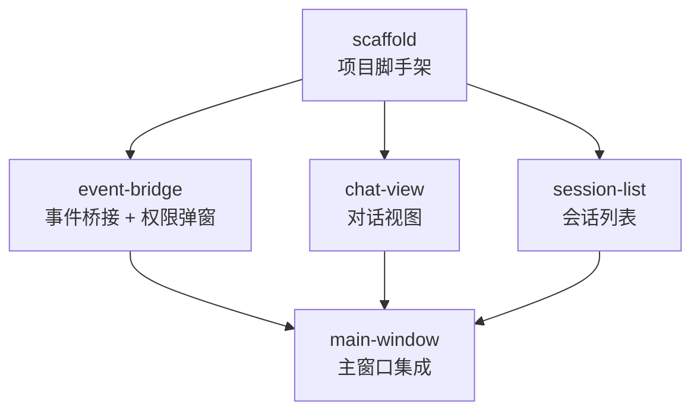

# DAG: PyQt5 GUI 扩展

## 拓扑顺序

| Batch | Task | 并行？ | 依赖 |
|-------|------|--------|------|
| 1 | scaffold | - | 无 |
| 2 | event-bridge, chat-view, session-list | ✅ 可并行 | scaffold |
| 3 | main-window | - | event-bridge, chat-view, session-list |

## 任务清单

| 任务 | 文件 | 分支 | 工时估计 |
|------|------|------|----------|
| scaffold | 7 个 | feat/gui-scaffold | 30min |
| event-bridge | 2 个 | feat/gui-event-bridge | 1h |
| chat-view | 5 个 | feat/gui-chat-view | 2h |
| session-list | 1 个 | feat/gui-session-list | 1h |
| main-window | 2 个 | feat/gui-main-window | 1h |
